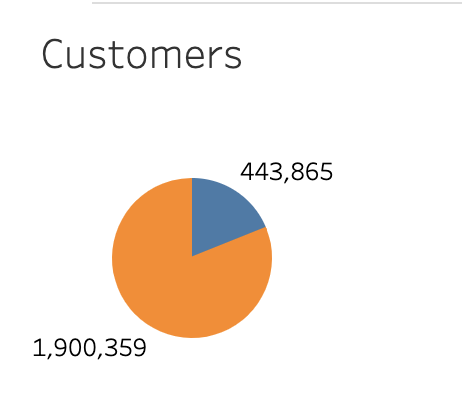
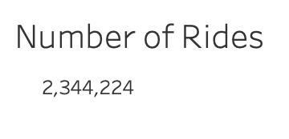
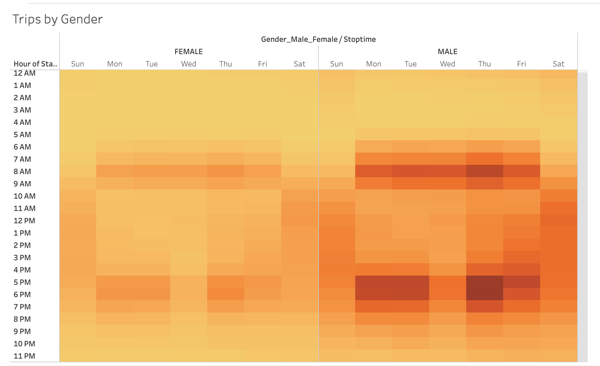
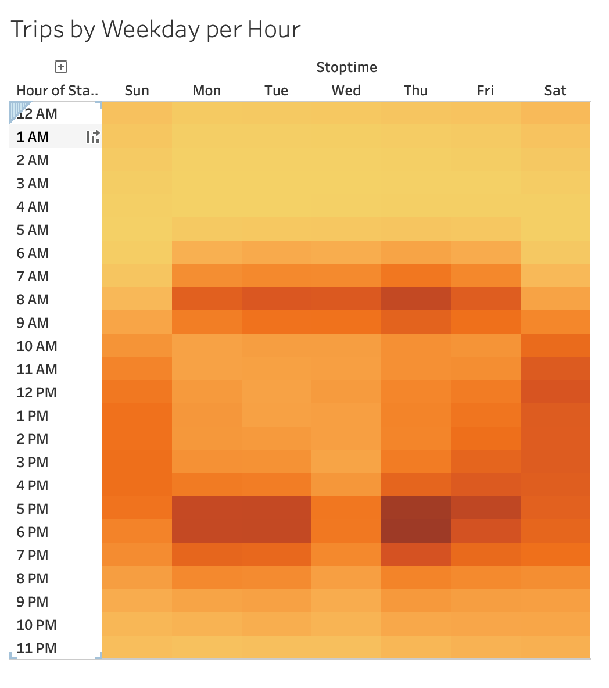
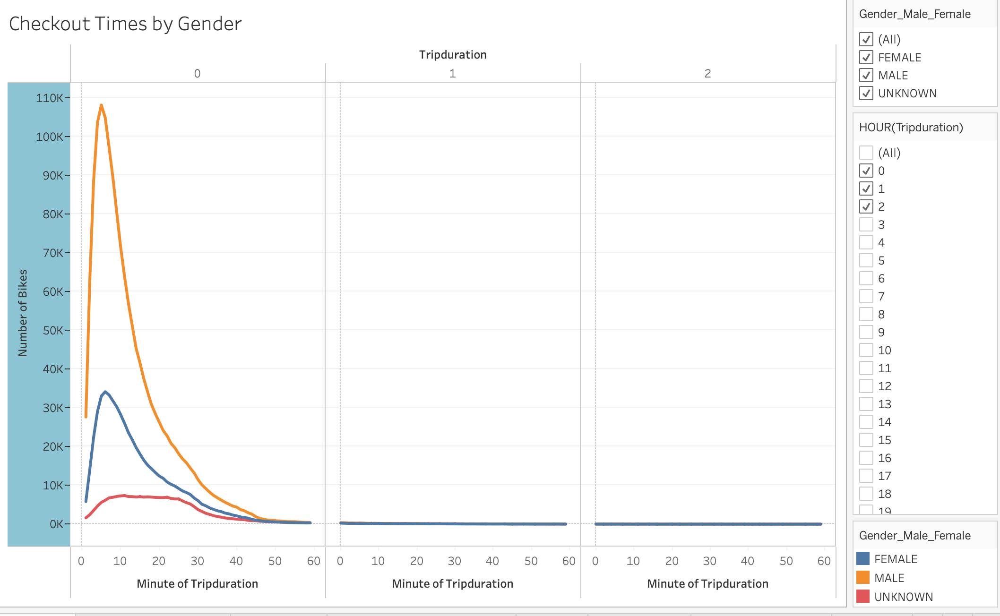
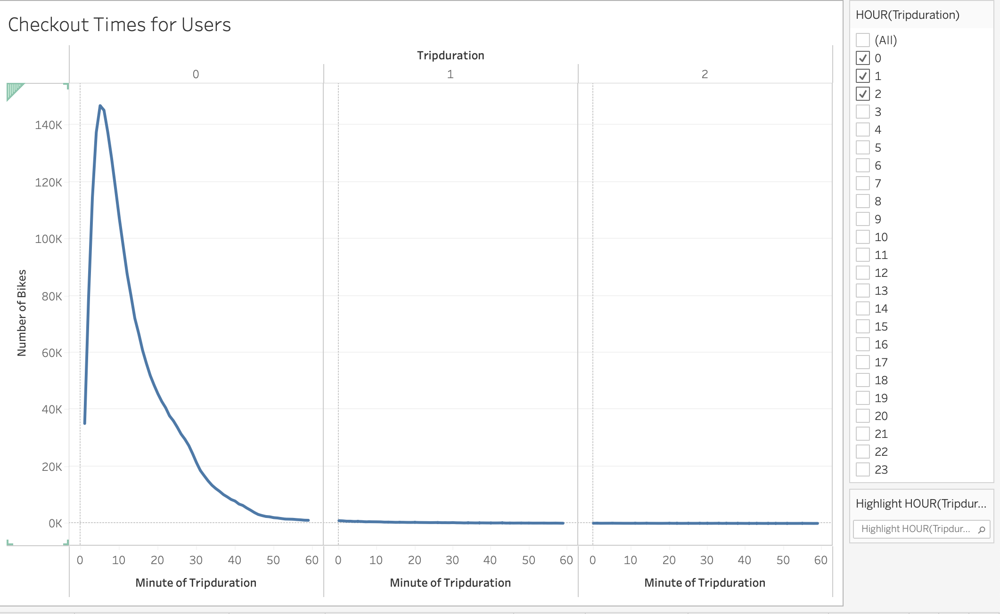
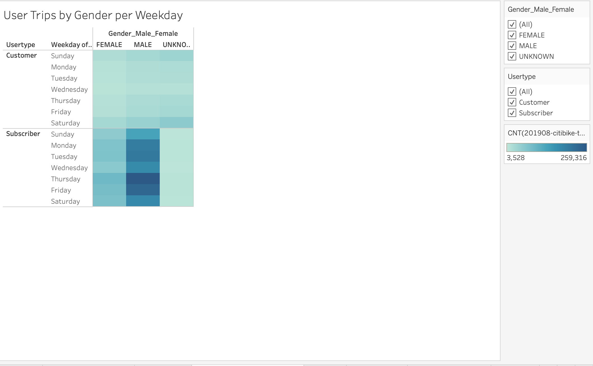
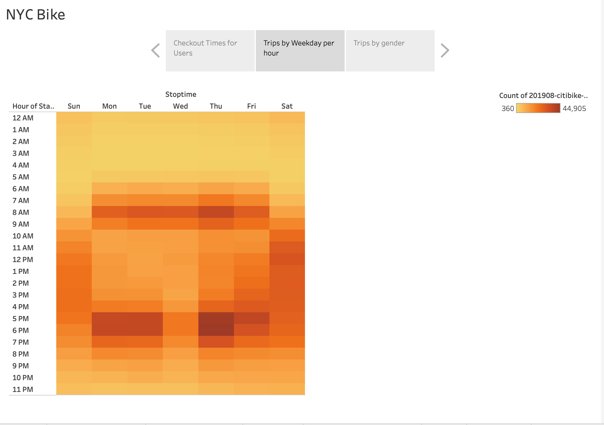

# Bikesharing

## Overview of Bikesharing 
This analysis is to convince investors that a bike-sharing program in Des Moines is a solid business proposal.

### Results
Visualization is created using stories and worksheets to show why bike sharing is great business. The following sections explains different stories and worksheets.

#### Worksheet: Number Of Customers
[Link to Tableau: Number of Customers](https://public.tableau.com/app/profile/jigisha6688/viz/NYC_Citibike_Challenge_Customers/Customers?publish=yes)

There are about 2.4M customers

#### Worksheet: Number Of Rides
[Link to Tableau: Number of Rides](
https://public.tableau.com/app/profile/jigisha6688/viz/NYC_Citibike_Challenge_Number_Of_Rides/NumberofRides?publish=yes)

There are about 2.4M rides

#### Worksheet: Trips By Gender
[Link to Tableau: Trips By Gender](
https://public.tableau.com/app/profile/jigisha6688/viz/NYC_Citibike_Challenge_Trips_By_Gender/TripsbyGender?publish=yes)

Monday to Friday between 6am to 9am and 4pm to 7pm is heavily used by Male customers. Over 10K trips are done per hour by Male customer.

#### Worksheet: Trips By Weekday Per Hour
[Link to Tableau: Trips By Weekday Per Hour](
https://public.tableau.com/app/profile/jigisha6688/viz/NYC_Citibike_Challenge_Trips_By_Weekday_Per_Hour2/TripsbyWeekdayperHour?publish=yes)

Monday to Friday between 6am to 9am and 4pm to 7pm are the busiest time for bike sharing. Over 15K trips are done per hour.

#### Worksheet: Checkout Time By Gender
[Link to Tableau: Checkout Time By Gender](
https://public.tableau.com/app/profile/jigisha6688/viz/NYC_Citibike_Challenge_Checkout_Time_By_Gender/CheckoutTimesbyGender?publish=yes)

Majority of bike riders are male who used bike for less than an hour. 

#### Worksheet: Checkout Time By User
[Link to Tableau: Checkout Time By User](
https://public.tableau.com/app/profile/jigisha6688/viz/NYC_Citibike_Challenge_Checkout_Time_For_Users/CheckoutTimesforUsers?publish=yes)

Majority of bike riders used bike for less than an hour.

#### Worksheet: User Trips Per Gender Per Weekday
[Link to Tableau: User Trips Per Gender Per Weekday](
https://public.tableau.com/app/profile/jigisha6688/viz/NYC_Citibike_Challenge_User_Trips_By_Gender_Per_Week/UserTripsbyGenderperWeekday?publish=yes)

Majority of bike riders are Male.

#### Stories ####
Worksheets included in the story:
- Checkout Time By User
- Trips By Weekday Per Hour
- Trips By Gender  

[Link to Tableau: Story](https://public.tableau.com/app/profile/jigisha6688/viz/NYC_Citibike_Challenge_16635679223980/NYCBike?publish=yes)

As discussed in the individual worksheet, majority of trips are less than 60 minutes in duration. During 6 hours which is peak hours in a day, over 100,000 bike rides happen every weekday. 

